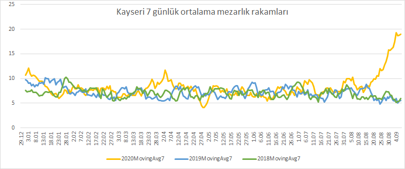

# Kayseri Mezarlık Verileri

Özellikle Ağustos ayı itibariyle Türkiye genelinde ve Kayseri ilinde hissedilir şekilde artış gösteren COVID-19 vaka ve vefat sayıları resmi rakamlarının resmi rakamlara yansımadığı şüphesiyle [Kayseri Mezarlık Bilgi Sistemi](https://cbs.kayseri.bel.tr/kayseri-mezarlik-bilgi-sistemi)'nden veriler 'scrape' edilerek çekilmiştir.

Program, belirlenen gün kadar önceden (`DAYS_AGO` değişkeni) güncel tarihe kadar her güne ait rakamlar 2020, 2019 ve 2018 yıllarını yansıtacak şekilde `kayseri-data.csv` dosyasına çıkartır. Her bir tarihe ait web sayfası görüntülerini `pdfs/` ve `screenshots/` klasörlerine kaydeder. Repo'da yalnızca pdfler bulunmaktadır.

Ayrıca `kayseri-data-processed.xlsx` dosyasında veriler birleştirilip 7 günlük ağırlıklı ortalama verileri (moving average) `kayseri-graph.png` grafiğine çıkarılmıştır. Grafik aşağıda görülmektedir. Açıkça görülmektedir ki Ağustos ayı başından beri günlük vefat eden kişi sayısı Kayseri ilinde 2018 ve 2019 yılları ortalmalarından 10-15 kişi fazla gerçekleşmektedir. Benzer rakamlar salgının yoğun yaşandığı, ve resmi rakamlarda da kamuoyuna açıklandığı şekilde, Nisan ayında da ortalamanın üzerindedir. 2020 yılında Kayseri merkezinde 01.09 itibari ile 2019 ve 2018 yılları ortalamalarından 212 kişi fazla vefat etmiştir. Kayseri nufusu ağırlığı hesaba katıldığında Türkiye geneli 12500 rakamı ortaya çıkmaktadır.

Kamuoyunda da konuşulduğu üzere, çekilen rakamlardan da görebildiğimiz gibi, resmi rakamların gerçek verileri yansıtmadığı şüphesi mevcuttur. Veriler yalnızca Kayseri ili merkezi için geçerli olup diğer illerin de hesaba katılması vefat sayılarının resmi rakamlardan uzak olacağı aşikardır. 

Bu rakamlar (mezarlık bilgi sistemi erişime kapatılmadığı sürece) periyodik olarak güncellencektir. Verileri teyit etmek isteyen kişiler her bir tarihte vefat eden kişileri ve kişi sayılarını veriler ile karşılaştırabilir, bu programı indirip verileri kendisi çekebilirler. 
